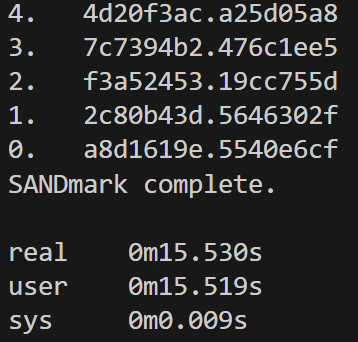

# UM Emulator - Warmup Exercise 1

**Name:** Yue Hu  
**ID:** 102041864  
**Date:** 2025-08-20  

---

## Compile Instructions
```bash
g++ -O2 -std=c++17 -o um um.cpp
```

---

## Run Instructions
```bash
./um helloworld.um   # print "Hello world!"
./um square.um       # enter a number, program prints its square
./um waste.um        # infinite loop with allocation
./um sandmark.um     # performance benchmark
```

---

## Timing Results (on callisto)
```text
$ time ./um sandmark.um
real    0m15.530s
user    0m15.519s
sys     0m0.009s
```


---

## Implementation Details
- **Registers:** 8 general-purpose 32-bit unsigned registers (`R[0..7]`).  
- **Memory:** A dynamic collection of arrays (segments), each identified by a 32-bit ID.  
  - Segment 0 (`arrays[0]`) holds the current program being executed.  
  - Segments can be allocated (op=8) and deallocated (op=9).  
- **Instruction Format:**  
  - Standard format: `[opcode:4][...unused...][A:3][B:3][C:3]`.  
  - Load Value (op=13) has a special format: `[opcode=13:4][A:3][value:25]`.  
- **Execution Loop:**  
  - Fetch instruction from `arrays[0][pc]`.  
  - Decode opcode and registers (A, B, C).  
  - Execute according to UM specification (conditional move, array index/amendment, arithmetic ops, I/O, program load, halt).  
  - Update `pc` unless overwritten (e.g., by `Load Program`).  
- **Error Handling:** Explicit checks for:  
  - Accessing unmapped segments.  
  - Array index out of bounds.  
  - Division by zero.  
  - Illegal opcode.  
- **I/O:**  
  - `op=10` outputs `R[C]` as an ASCII character.  
  - `op=11` reads one byte from input or stores `0xFFFFFFFF` on EOF.  
- **Halt:**  
  - `op=7` sets `halted = true`, ending execution loop.

---
